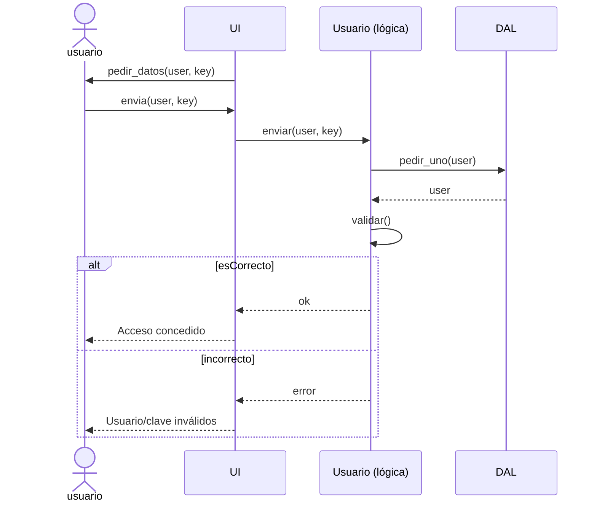

#clase_10

![[Pasted image 20251001190604.png]]

![[Pasted image 20251001191618.png]]

![[Pasted image 20251001192838.png]]

![[Pasted image 20251001193157.png]]

StarUML
![[Pasted image 20251001193302.png]]


![[Pasted image 20251001193340.png]]

![[Pasted image 20251001193820.png]]

![[Pasted image 20251001193902.png]]

---


![[Pasted image 20251001194448.png]]

Ejercicio 1 y 2 de la actividad 1


---


![[Pasted image 20251001213450.png]]


![[Acitvidad_1_3-M3_08_03_ACTIVIDAD_01_Azul_Luciano.pdf]]

![[Acitvidad_1-M3_08_03_ACTIVIDAD_01_Camila_Luciano.pdf]]


---


![[Pasted image 20251001213834.png]]

![[Pasted image 20251001214311.png]]

---


# Actividad
```
sequenceDiagram
    actor usr as usuario
    participant UI as UI
    participant BL as Usuario (lógica)
    participant DAL as DAL

    UI ->> usr: pedir_datos(user, key)
    usr ->> UI: envia(user, key)

    UI ->> BL: enviar(user, key)
    BL ->> DAL: pedir_uno(user)
    DAL -->> BL: user
    BL ->> BL: validar()

    alt esCorrecto
        BL -->> UI: ok
        UI -->> usr: Acceso concedido
    else incorrecto
        BL -->> UI: error
        UI -->> usr: Usuario/clave inválidos
    end
```




![[Pasted image 20251001221301.png]]


Reajuste posterior
```
sequenceDiagram
    actor usr as usuario
    participant UI as UI
    participant BL as Usuario
    participant DAL as DAL

    UI ->> usr: pedir_datos(user, key)
    usr ->> UI: envia(user, key)

    UI ->> BL: pedir_uno(user)
    BL ->> DAL: ejecutarSP_DS(SP)
    DAL -->> BL: :ds
    BL -->> UI: :user
    UI ->> UI: validar()

    alt esCorrecto
        UI -->> usr: Acceso concedido
    else incorrecto
        UI -->> usr: Usuario/clave inválidos
    end
```
![[Pasted image 20251001221739.png]]


Ej de compañeros
![[Pasted image 20251001221259.png]]
